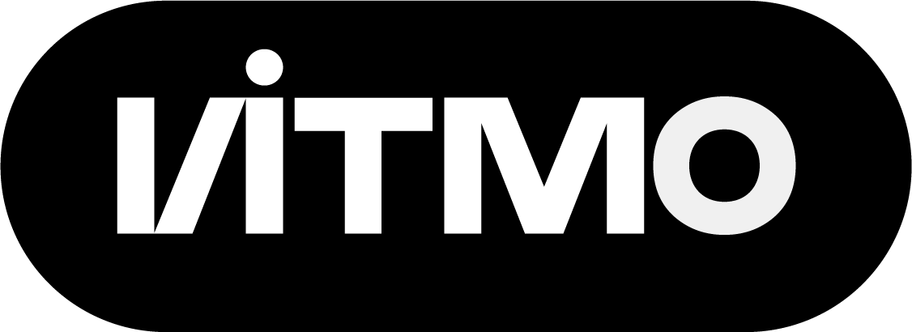

# Rostok

Rostok is an open source Python framework for co-design of grasping mechanisms. It provides a framework to describe mechanisms as a graph, set the environment, perform simulation of the mechanism, get simulation reward and start the search for the best design. User can use the whole pipeline to get from nodes/details specification to the result of the search algorithm or use the individual modules. Library flexible design allows a user to implement custom generative rules and search algorithms. 

Currently, the generative co-design is mainly used in production of the static systems, while our project goal is to shift the generative design to the domain of the dynamic systems.

## Project desription

There are four main blocks:  

* Graph grammar - build, modification and get information from the graphs that contains full information of the mechanism
* Virtual experiment - simulate the mechanism specified by the graph and get the reward for the attempt to grasp the body
* Trajectory optimization - search for the optimal control of the mechanism in order to solve the task  
* Search algorithm - traverse the space of the possible designs in order to achieve the better reward

More detailed description of the [algorithms and methods](docs/Algorithm.md). 

## Prerequisites

* Anaconda3 
* Usage of the Docker reqires installation of Х-server for Windows https://sourceforge.net/projects/vcxsrv/

## Installation in development mode 

Rostok library is a framework that allows user to tune it for solving various task. Therefore, in order to get the full potential of the library a user should install it in development mode:  

* Create the environment using `conda env create -f environment.yml`
* activate the environment `rostok`  
* Install the lates version of PyChrono physical engine using `conda install -c projectchrono pychrono`  
* Install the package in development mode `pip3 install -e .`  

### Known issues 

At some computers one can see a problem with the tcl module `version conflict for package "Tcl": have 8.6.12, need exactly 8.6.10`, try to install tk 8.6.10 using `conda install tk=8.6.10`

After the installation of the package one can get an error `Original error was: DLL load failed while importing _multiarray_umath: The specified module could not be found` , try to reinstall numpy in the rostok environment

## Documentation

The description of the project and tutorials are available [at project websitehere](https://licaibeerlab.github.io/graph_assembler/).

## Publications

* I. I. Borisov, E. E. Khornutov, D. V. Ivolga, N. A. Molchanov, I. A. Maksimov and S. A. Kolyubin, "Reconfigurable Underactuated Adaptive Gripper Designed by Morphological Computation," 2022 International Conference on Robotics and Automation (ICRA), 2022, pp. 1130-1136, doi: 10.1109/ICRA46639.2022.9811738.

## Examples

The example of configuration and using the generative pipeline is in `rostok\app` directory.  
The examples of usage of individual modules is in `rostok\examples` directory. 

## Acknowledgments

### Affiliation

The library was developed in [ITMO University](https://en.itmo.ru/).

### Developers

* Ivan Borisov - chief scientist 
* Kirill Zharkov - team leader
* Yefim Osipov
* Dmitriy Ivolga
* Kirill Nasonov
* Mikhail Chaikovskii

## Contacts

* Ivan Borisov borisovii@itmo.ru for scientific aspects of the project
* Kirill Zharkov kzharkov@itmo.ru for technical questions